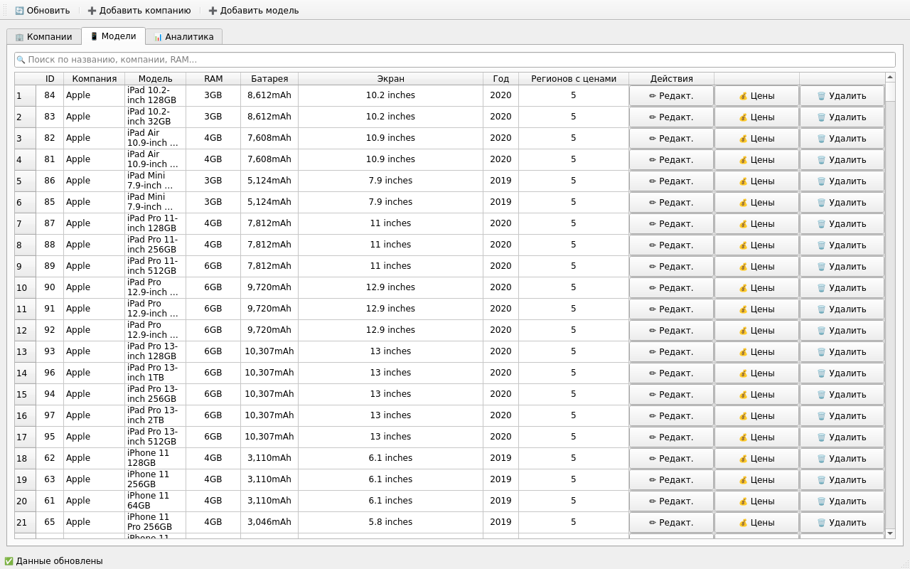
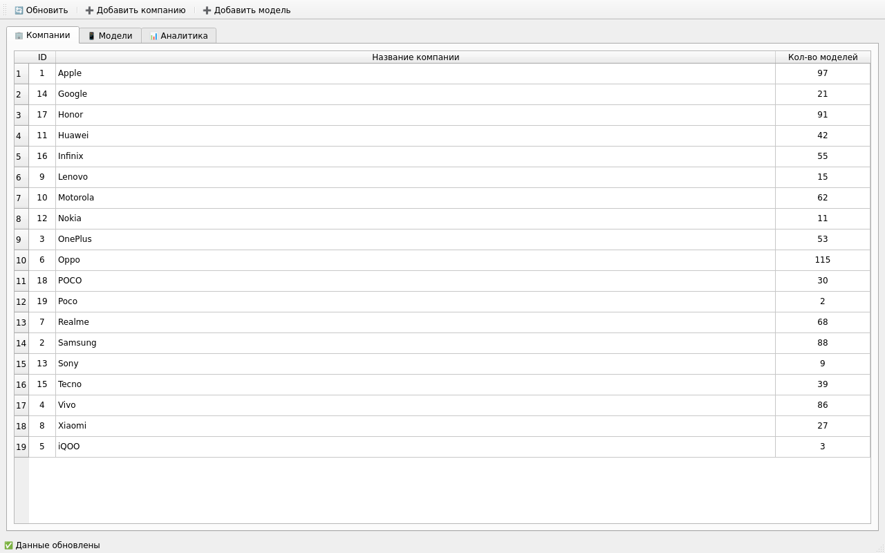
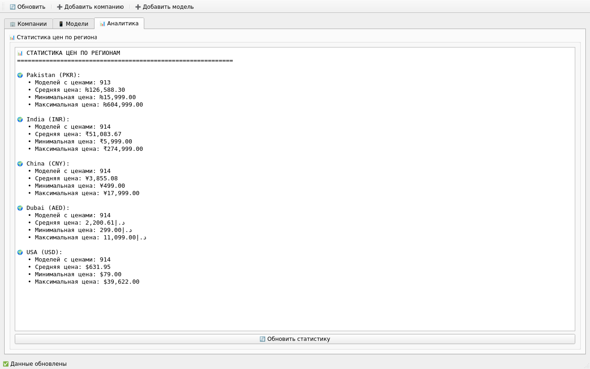

# Mobile Devices Database

[Русский](README.md) · **English**

[](https://github.com/EDeev/mobiles_dataset/actions/workflows/ci.yml)
[](https://github.com/EDeev/mobiles_dataset/releases)

Database design coursework: the 2025 mobile devices dataset split into a normalized PostgreSQL database,
a PyQt6 desktop app to work with it, and a measurement of index gains with `EXPLAIN ANALYZE`.

**Status:** coursework ("Database Design and Administration", Moscow Polytechnic University, 2025), completed



**Stack:** Python 3.11 · PostgreSQL 15 · psycopg2 · PyQt6 · pandas · Docker

## Features

- 3NF schema of five tables (companies, processors, models, regions, prices) with foreign keys and
  cascading actions
- Import of the [Kaggle dataset](https://www.kaggle.com/datasets/abdulmalik1518/mobiles-dataset-2025)
  (930 rows; 914 models and 4569 prices after cleaning) split into reference tables
- App: adding companies, models with create, edit and delete, prices in five regions (Pakistan, India,
  China, UAE, USA) with currency symbols, search by name, company and RAM, a price statistics tab
- Index experiment: `EXPLAIN ANALYZE` queries before and after, plans saved in `sql/explain_results/`

| Metric | No indexes | With indexes | Difference |
|---|---|---|---|
| Search | 0.234 ms | 0.089 ms | 62% faster |
| Four-table JOIN | 18.6 ms | 0.95 ms | 95% faster |
| Planner cost | 44.76 | 12.45 | 72% lower |
| Rows scanned | 914 | 18 | 98% fewer |

Measured on this dataset (hundreds of rows), so absolute times are fractions of a millisecond.

## Quick start

```bash
git clone https://github.com/EDeev/mobiles_dataset.git && cd mobiles_dataset
docker compose up -d                  # PostgreSQL 15 with the schema from sql/create_schema.sql
pip install -r requirements.txt
python scripts/import_data.py         # load the dataset
python main.py                        # the app
```

A ready-made Windows build (`.exe`) is in the [releases](https://github.com/EDeev/mobiles_dataset/releases).

## Without Docker

1. Run `sql/create_schema.sql` in psql or pgAdmin as `postgres` — the script creates the
   `mobile_devices_db` database itself.
2. Set the connection with `DB_HOST`, `DB_PORT`, `DB_NAME`, `DB_USER`, `DB_PASSWORD`
   (defaults: `localhost:5432`, `mobile_devices_db`, `admin` / `password`).
3. `python scripts/import_data.py`, then `python main.py`.

## Screenshots

| Companies | Analytics |
|---|---|
|  |  |

## License

Coursework (Database Design and Administration, Moscow Polytechnic University, 2025). The code is open
for study; there is no separate license. The dataset comes from Kaggle under its author's terms.

## Author

**Egor Deev** — [GitHub](https://github.com/EDeev) · [Telegram](https://t.me/DeevEgor) · [egor@deev.space](mailto:egor@deev.space)

---

<div align="center">
  <sub>⭐ If you find this project useful, give it a star on GitHub!</sub>
  <p><sub>Made with ❤️ — <a href="https://deev.space">deev.space</a></sub></p>
</div>
